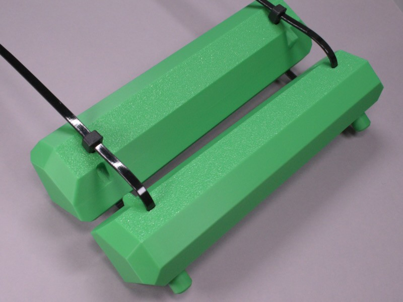

<!-- SPDX-License-Identifier: CC-BY-SA-4.0 -->
<!-- SPDX-FileCopyrightText: Copyright 2024 Sam Blenny -->
# Spool Rollers

This repo documents my project to make a 3D printable spool rollers to fit in
a plastic cereal box. I wanted to make a filament dry box so I could feed
filament without having to unseal the box.

This didn't work out like I'd hoped because the plastic box was a little bit
too narrow to accomodate the bearings without them rubbing against the box's
side walls. But, it was a good project for learning to use OpenSCAD. Also, I
made some models for calibrating XY hole/contour compensation and bearing
press fit post diameter which may be useful elsewhere.

This is what the finished spool roller looks like:

## Additional Photos

1. These are my press fit and XY compensation calibration blocks:

    

2. These are the two halves of the spool roller frame. The fins and slots are
   designed with 0.1mm clearance, so, with well calibrated extrusion flow and
   XY compensation, they press fit with light pressure. The zip ties hold
   everything in place securely. Printing the frame halves at a 45° angle makes
   the bearing posts strong without requiring supports that might mess up the
   press fit tolerance.

    

3. This is the fully assembled spool roller with 608-2RS press fit bearings.

    

4. Here, the spool roller is inside the air-tight plastic cereal box with a
   spool of filament. The bearings are jammed against the side of the cereal
   box, so the spool doesn't roll properly.

    

